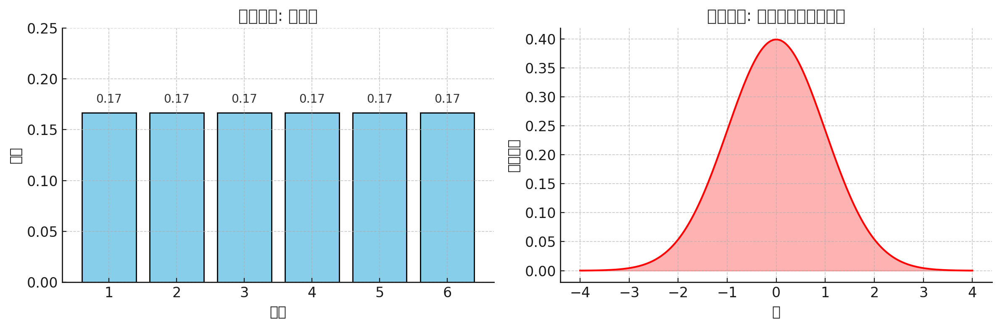

这个问题问得特别好 👍，很多人学量化时看到“概率分布”会有点懵，尤其是和初高中学过的“古典概率”混在一起。我们分层解释：

---

## 1. 古典概率

这是最基础的概率论定义：

$$
P(A) = \frac{\text{有利情况数}}{\text{总情况数}}
$$

例如：

* 掷一个公平骰子，掷出点数 3 的概率就是 $1/6$。
* 掷出偶数的概率就是 $3/6 = 1/2$。

特点：

* 结果是 **有限且等可能** 的。
* 强调“计数” → 多少种情况。

---

## 2. 概率分布

当结果 **很多甚至连续** 时，古典概率那种“有多少情况就除多少”的方法就不适用了，于是我们用概率分布来描述。

### 离散概率分布

比如骰子：

$$
P(X=1)=\tfrac{1}{6}, \, P(X=2)=\tfrac{1}{6}, \ldots, P(X=6)=\tfrac{1}{6}
$$

这其实就是一个 **离散型分布**（均匀分布）。

### 连续概率分布

比如人的身高，不可能只取有限几个值，而是 160.1 cm、160.15 cm… 可以无限精细。
这时用 **概率密度函数 (PDF)** 描述：

$$
P(a \leq X \leq b) = \int_a^b f(x) dx
$$

这里 $f(x)$ 就是概率分布函数。

特点：

* 概率分布是一个 **整体规律**，描述随机变量在各个可能取值上的“可能性大小”。
* 可以是离散的，也可以是连续的。

---

## 3. 二者的关系

* **古典概率**：概率分布的最简单情况（有限个、等可能）。
* **概率分布**：更一般的概念，可以处理 **不等可能**、**无限情况**、**连续变量**。

---

## 4. 在量化中的“概率分布”

当我们说“激活值的概率分布”时，其实就是：

* 收集一层输出的所有值（比如几万个浮点数）。
* 用直方图统计它们 → 得到一个近似的分布。
* 这个分布不是古典概率（不是有限个等可能结果），而是统计结果形成的 **经验分布**。

举例：

* 某卷积层输出的值大多在 $[-1,1]$ 之间，接近 0 的地方最多，远离 0 的少。
* 画出来就是一个类似钟形的概率分布（类似正态分布）。
* 在量化时，KL 散度/MinMax/MMSE 就是在和这个分布打交道。

---

✅ **总结**

* 古典概率：有限个等可能情况，强调“数出来”。
* 概率分布：一般情况，描述随机变量在不同值上的可能性，既可以离散也可以连续。
* 量化中的分布：通过统计数据（直方图）得到的经验分布，用来指导 scale/阈值选择。

---

要不要我给你画一张 **图对比：古典概率（掷骰子 6 个点等可能） vs 激活分布（钟形直方图）**？这样直观很多。

这里给你画了两张图：

* **左边（古典概率）**：掷骰子，每个点数出现的概率都一样 $1/6$。这是典型的古典概率——有限个、等可能情况。
* **右边（概率分布）**：像神经网络激活值，接近 0 的值出现最多，两边少，看起来像钟形曲线（正态分布）。这是概率分布——描述“数值出现的整体规律”。

👉 可以看到，古典概率只是概率分布的一个特例（有限且等可能），而概率分布可以表达更复杂的情况。

要不要我进一步结合 **KL 散度** 在这两种分布上的应用，做一个可视化例子？
